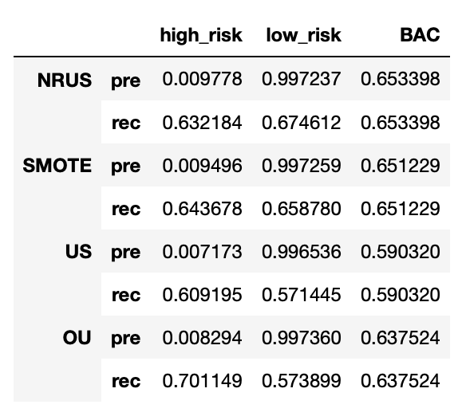
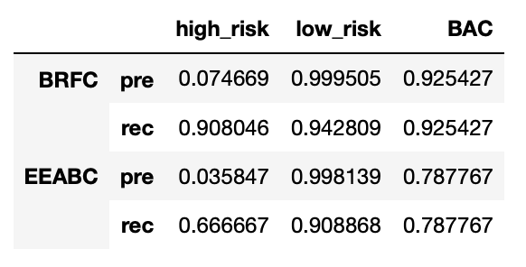

# Credit_Risk_Analysis

## Overview

This analysis compares the performance of 6 machine learning algorithms in classifying loan outcomes based on an unbalanced dataset. 

### Models

  * Sampling approaches:
    * Oversampling: RandomOverSampler, SMOTE
    * Undersampling: ClusterCentroids
    * Over and Undersampling: SMOTEENN
  * Ensemble classifiers:
    * BalancedRandomForestClassifier, EasyEnsembleClassifier

## Results

### Resampling Models

  * The high risk precision score for the resampling models was conisistently very low indicating a large proportion of loans classified as high risk by the models were actually low risk; the high risk recall scores were also similar across the models, between 0.61 and 0.70, indicating a somewhat reliable  true positive rate
  
  * Recall scores were similar for high risk and low risk categories for these models. 
  
  * As expected for an unbalanced dataset, precision scores for low risk accounts were very high.

### Ensemble Models

  * The recall score for the Balanced Random Forest Classifier was notably high, indicating a comparatively high proportion of correctly identified high risk loans. However the high risk precision scores for both models, while being higher than the resampling models, were very low. 

## Summary

All the models had very high precision for low risk loans and very low precision for high risk loans, reflecting the unbalanced dataset and indicating that a large proportion of low risk loans were misclassified as high risk. 

### Recommendation

Out of the models, the Balanced Random Forest Classifier algorithm performed the best, with the highest high risk recall rate and therefore highest balanced accuracy score. However, this model would still be overly conservative, with many low risk loans being misclassified as high risk and resulting in a large proportion of low risk loans being rejected. However, the BRFC model is most likely to correctly identify a high risk loan. 
